# Forecasting-HIV-Infections Case Study
# Part 1

* Figure out what are some most significant drivers of HIV infection 
* What machine learning models to choose
* Next Step
# 02 Dataset
We used the merged dataset to explore the data: it has 3140 rows x 39 columns. Year of 2015.
# 03 Features Choosing 
Most of the columns names are professional medical terms. We created an excel file for a better understanding.
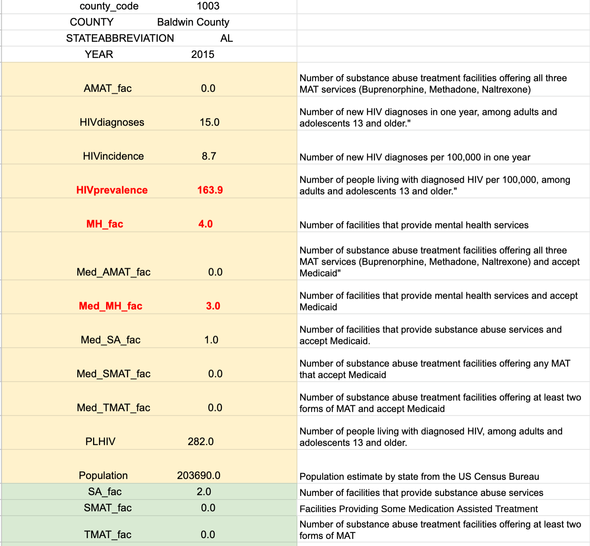
We got a corelation matrix but it's not very helpful
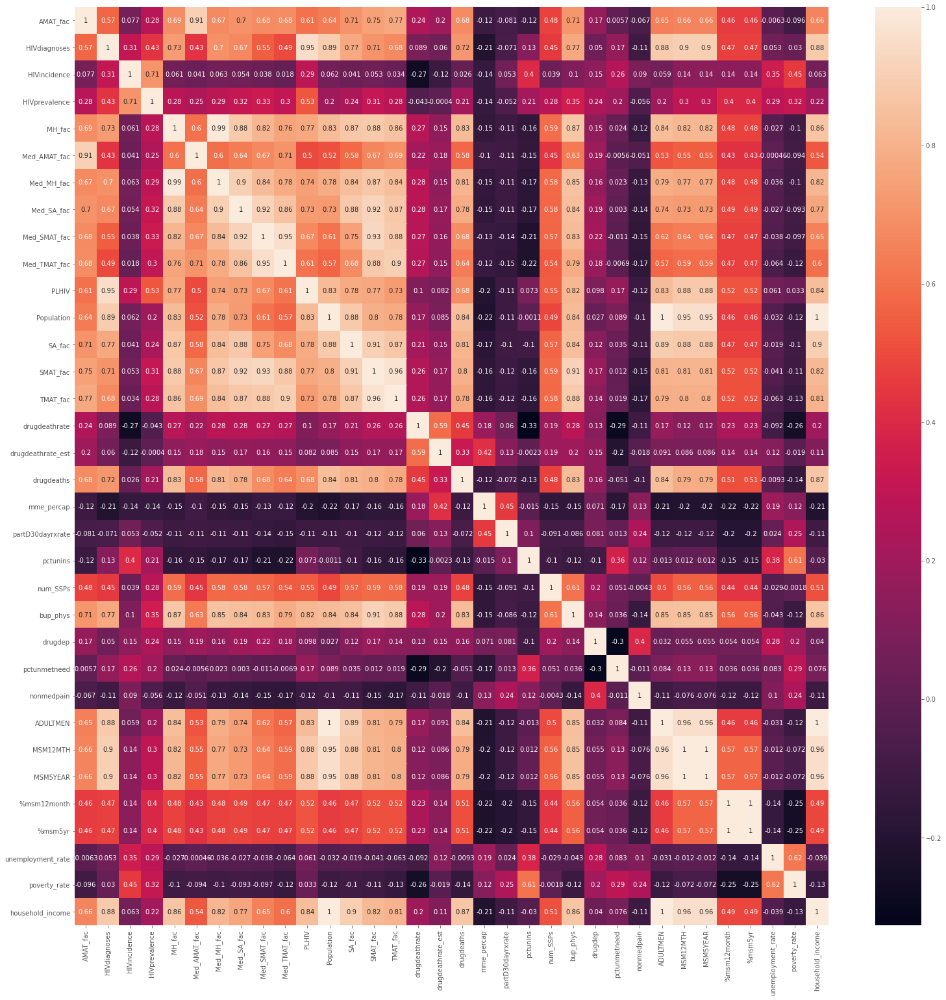
Corelation for HIV incidence and other featurs in a descending order. 
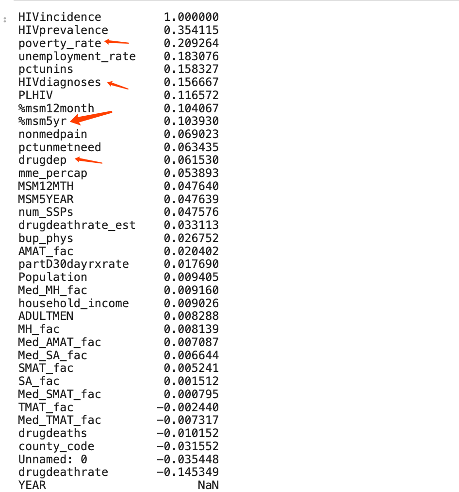


## Regression Model
Based on the initial Correlation Matrix and Scatter plot the strongest correlation with Incidence was prevalence but still not too big of a number.
Based on this, domain research and a lot of trial and error we picked our features:
```'HIVprevalence', 'poverty_rate','household_income', 'num_SSPs', 'pctunins'```
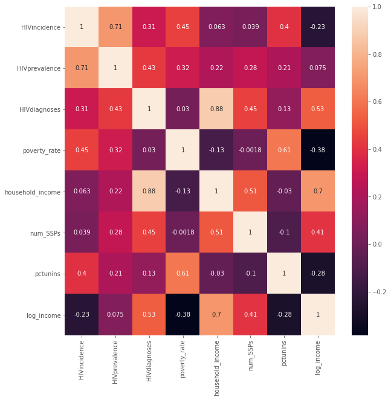
In the first step we built an OLS model with all the features and only picked the ones that had the lowest p_values and were not highly correlated with each other.
Then ran a k-fold cross validation on train data and test data. Our error metric(RMSE) was very low on the test set and very high on the train set which was odd.  
After looking back at the target (HIV incidents), turns out there is an outlier that we did not consider in the beginning. 
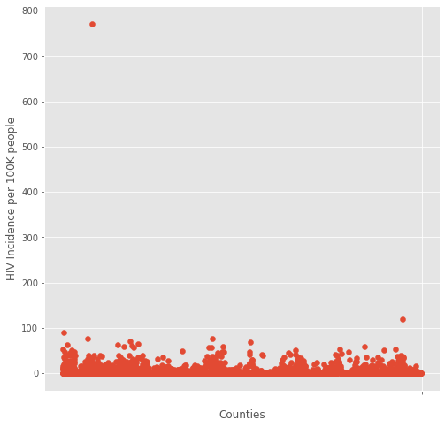
Scott county, IN due to an HIV out break in 2015, had 771 HIV incidences per 100,000 people wich is 192 times more than average (average is 4.04 per 100,000)
We had to take that out of the data set and start again.
This time we got better results comparing RMSE of traning set and testing set.
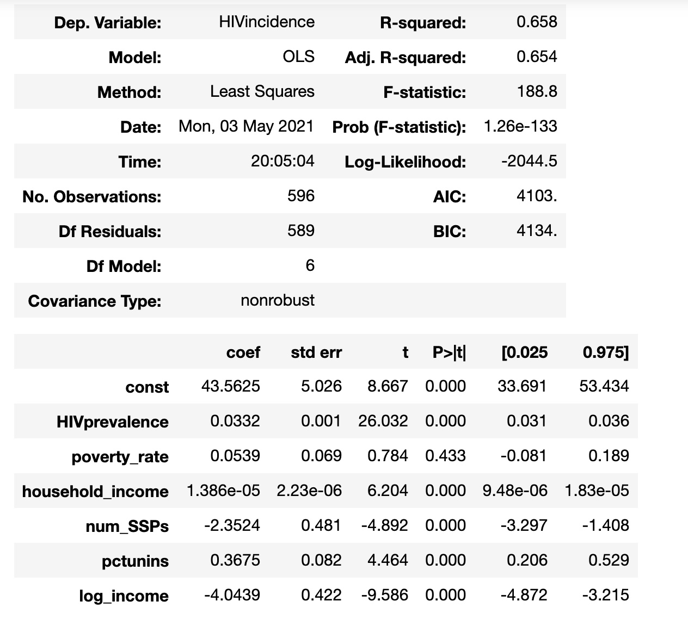
Poverty was taken out because of the P-value of 0.433 and house_holdincome got transformed to Log of income. And num_SSPs is categorical so we didn't include that in our next model. 
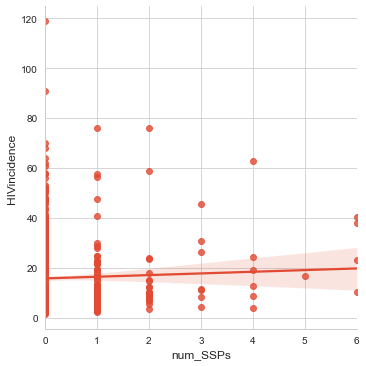
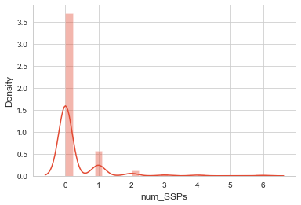
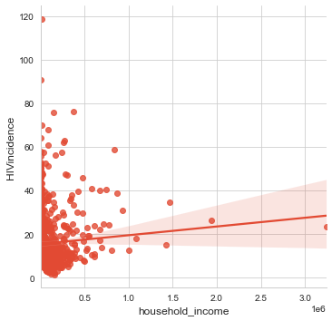
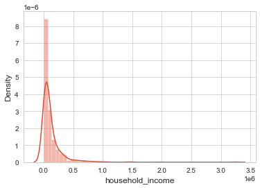
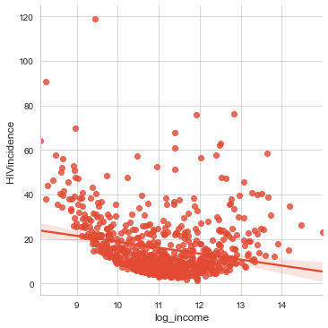
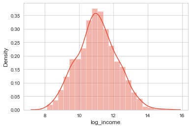
3 models were built :OLS , Ridge and Lasso.
Out of all the 3 we got the best results with OLS where the R-Squared was 0.63, RMSE on training set was 7.4 and on test set was 8.3.
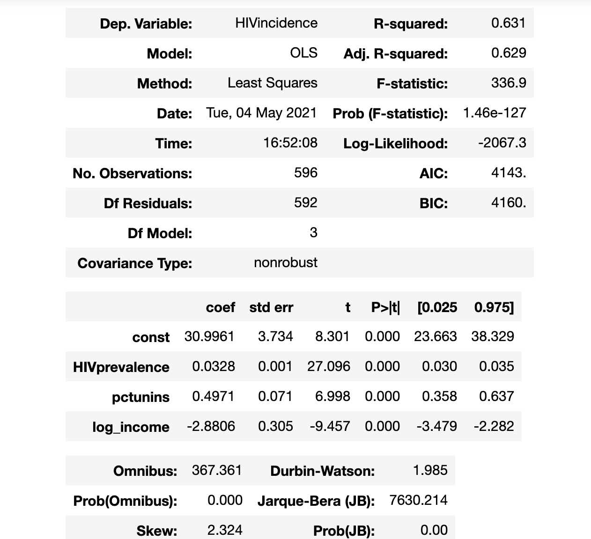


## Further Analysis

- **African American Population**
- Better HIV Collection Statistics

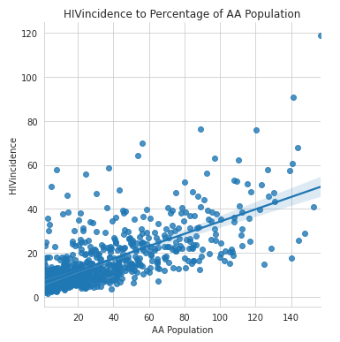

- HIV incidence doesn't nessessarily have a direct relationship with percentage of a population being African American.
- Population growth means that over time for a constant rate of infection, an increasing number of infections will be seen.

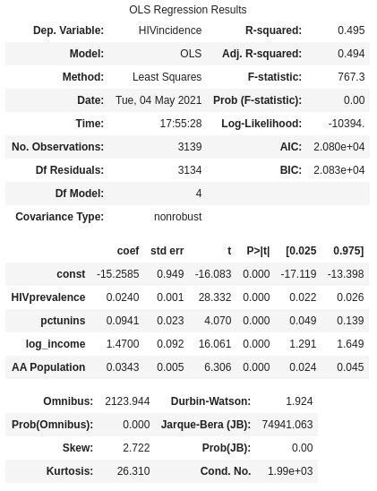

## Future
- Removing rows where HIV data was suppressed resulted in over 70% reduction in usable data.
- Finding more accurate HIV collection data could expand counties explored, specifically greater than ~750.
